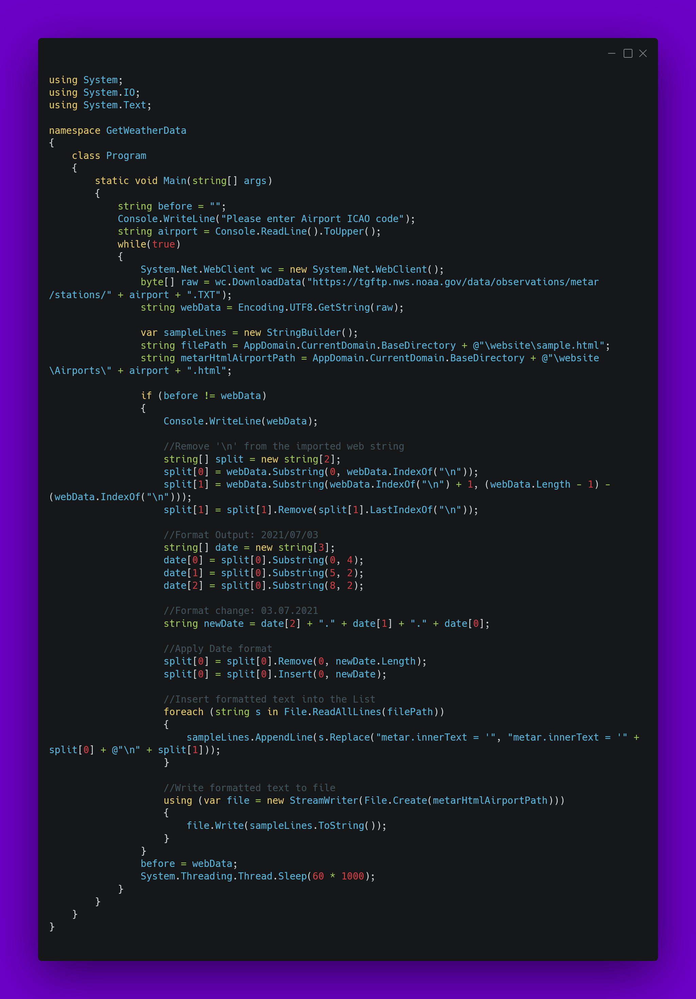

# GetWeatherData
This is a Tool to get a html that refreshes every 60 seconds for [OBS](https://obsproject.com/). The HTML file can be bound as a local browser souce file. No additional settings are needed. Optional you can change the color, with a "Filter" called "Color Correction".
The Console shows the updates and you can manually seclect the airport with an [ICAO Code](https://en.wikipedia.org/wiki/ICAO_airport_code).
If you run the Code, you need to have the [C# Libary](https://dotnet.microsoft.com/download/dotnet/5.0) installed to run it. If you're just using the Release, then you need nothing to install.

List of possible stations: https://tgftp.nws.noaa.gov/data/observations/metar/stations/

